# System Architecture

## Overview

The FashionStore system follows a Model-View-Controller (MVC) architecture pattern, providing a clear separation of concerns between data access, business logic, and presentation layers.

## High-Level Architecture

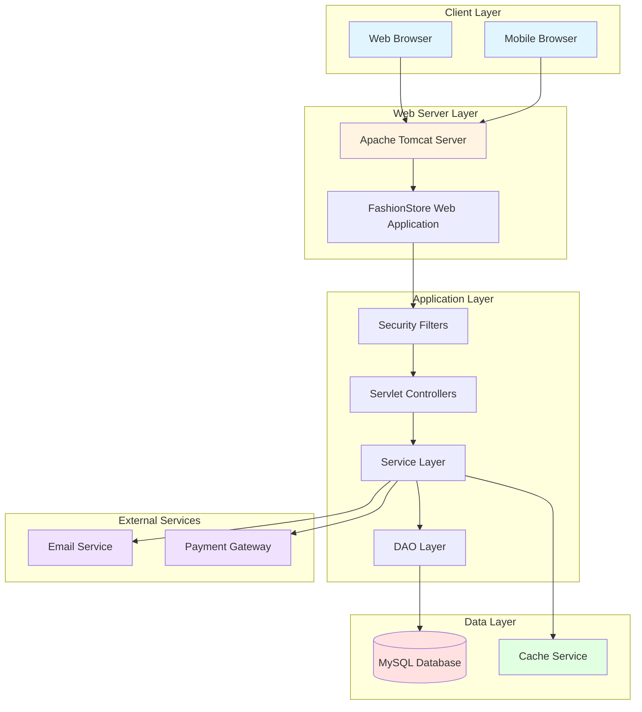

## MVC Architecture Pattern

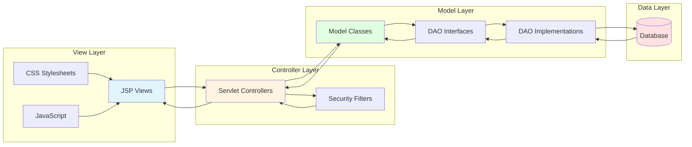

## Request Flow Architecture

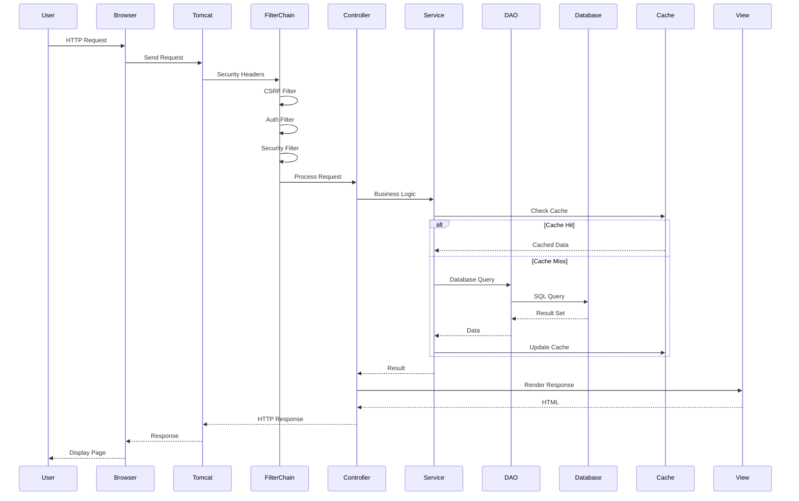

## Package Structure

```mermaid
graph TB
    Root[com.fashionstore]
    
    subgraph "Controller Package"
        Ctrl[controller]
        Home[HomeServlet]
        Login[LoginController]
        Register[RegisterController]
        Product[ProductController]
        Cart[CartController]
        Checkout[CheckoutController]
        Order[OrderController]
        Admin[Admin Controllers]
    end
    
    subgraph "Model Package"
        Model[model]
        User[User]
        Product[Product]
        Order[Order]
        Cart[CartItem]
        Wishlist[WishlistItem]
    end
    
    subgraph "DAO Package"
        DAO[dao]
        UserDAO[UserDAO]
        ProductDAO[ProductDAO]
        OrderDAO[OrderDAO]
    end
    
    subgraph "DAO Implementation Package"
        DAOImpl[daoimpl]
        UserDAOImpl[UserDAOImpl]
        ProductDAOImpl[ProductDAOImpl]
        OrderDAOImpl[OrderDAOImpl]
    end
    
    subgraph "Service Package"
        Svc[service]
        UserService[UserService]
        ProductService[ProductService]
    end
    
    subgraph "Filter Package"
        Flt[filter]
        Auth[AuthFilter]
        Security[SecurityFilter]
        CSRF[CSRFFilter]
        Headers[SecurityHeadersFilter]
    end
    
    subgraph "Security Package"
        Sec[security]
        CSRFProt[CSRFProtection]
        Rate[RateLimiter]
    end
    
    subgraph "Cache Package"
        Cache[cache]
        CacheSvc[CacheService]
        CacheKey[CacheKey]
        CacheTTL[CacheTTL]
    end
    
    subgraph "Utility Package"
        Util[util]
        DB[DBConnection]
        Validator[Validator]
    end
    
    Root --> Ctrl
    Ctrl --> Home
    Ctrl --> Login
    Ctrl --> Register
    Ctrl --> Product
    Ctrl --> Cart
    Ctrl --> Checkout
    Ctrl --> Order
    Ctrl --> Admin
    
    Root --> Model
    Model --> User
    Model --> Product
    Model --> Order
    Model --> Cart
    Model --> Wishlist
    
    Root --> DAO
    DAO --> UserDAO
    DAO --> ProductDAO
    DAO --> OrderDAO
    
    Root --> DAOImpl
    DAOImpl --> UserDAOImpl
    DAOImpl --> ProductDAOImpl
    DAOImpl --> OrderDAOImpl
    
    Root --> Svc
    Svc --> UserService
    Svc --> ProductService
    
    Root --> Flt
    Flt --> Auth
    Flt --> Security
    Flt --> CSRF
    Flt --> Headers
    
    Root --> Sec
    Sec --> CSRFProt
    Sec --> Rate
    
    Root --> Cache
    Cache --> CacheSvc
    Cache --> CacheKey
    Cache --> CacheTTL
    
    Root --> Util
    Util --> DB
    Util --> Validator
    
    style Ctrl fill:#e1f5ff
    style Model fill:#e1ffe1
    style DAO fill:#fff4e1
    style DAOImpl fill:#ffe1e1
    style Svc fill:#f0e1ff
    style Flt fill:#ffe1ff
    style Sec fill:#e1ffe1
    style Cache fill:#fff4e1
    style Util fill:#e1f5ff
```

## Filter Chain Architecture

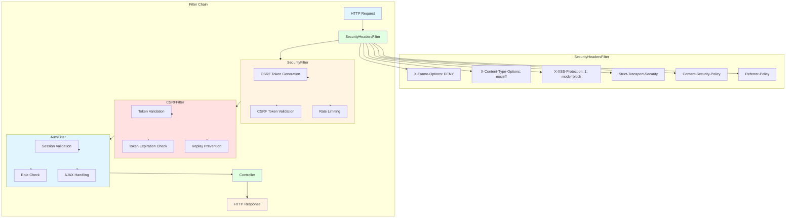

## Service Layer Architecture

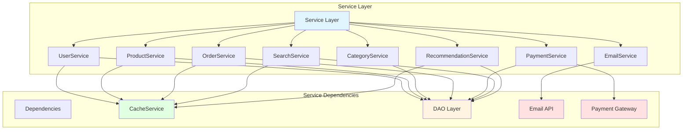

## Data Access Layer Architecture

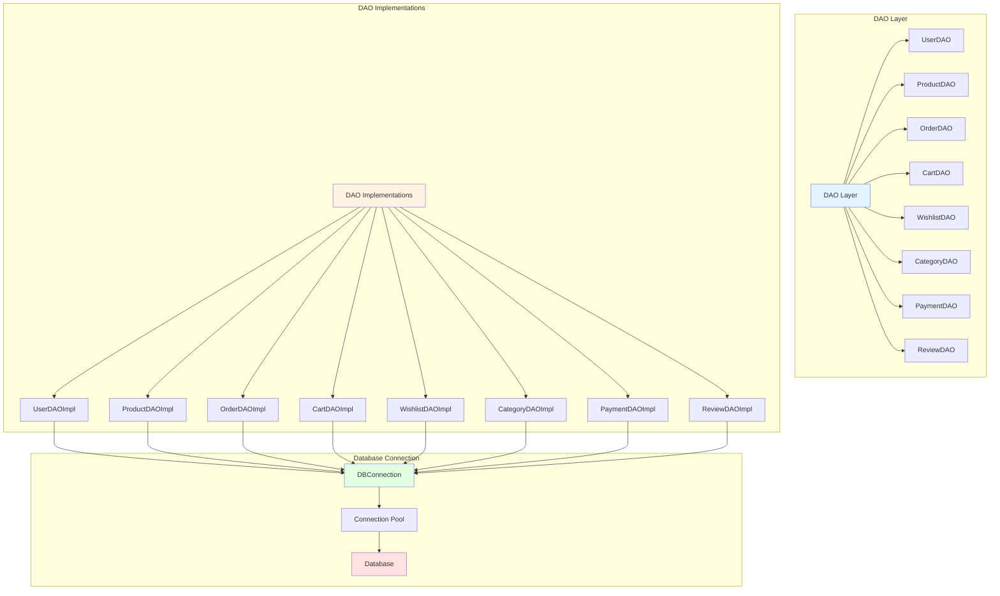

## Caching Architecture

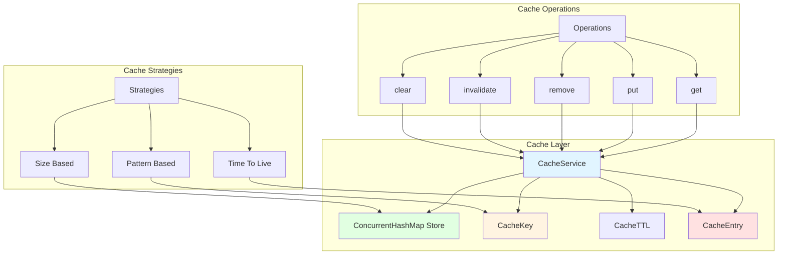

## Security Architecture

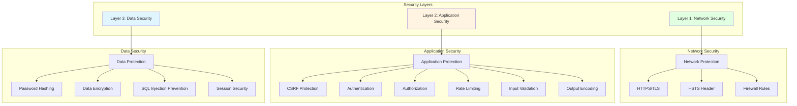

## Transaction Management Architecture

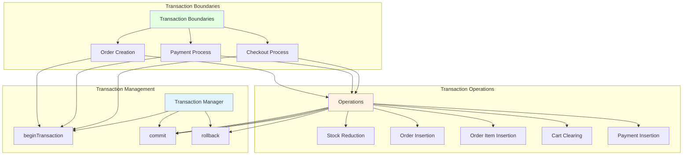

## Error Handling Architecture

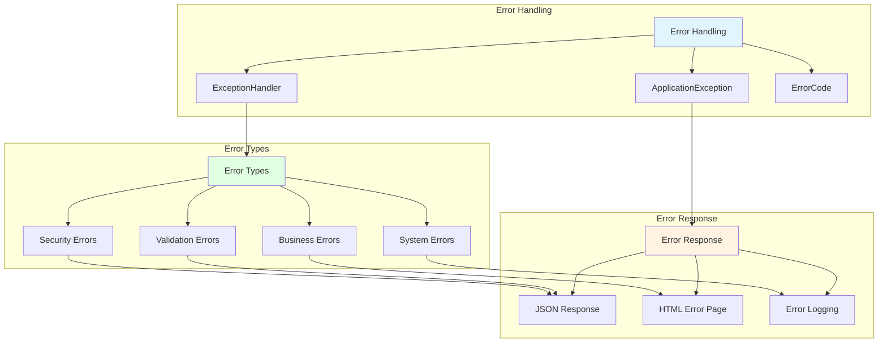

## Logging Architecture

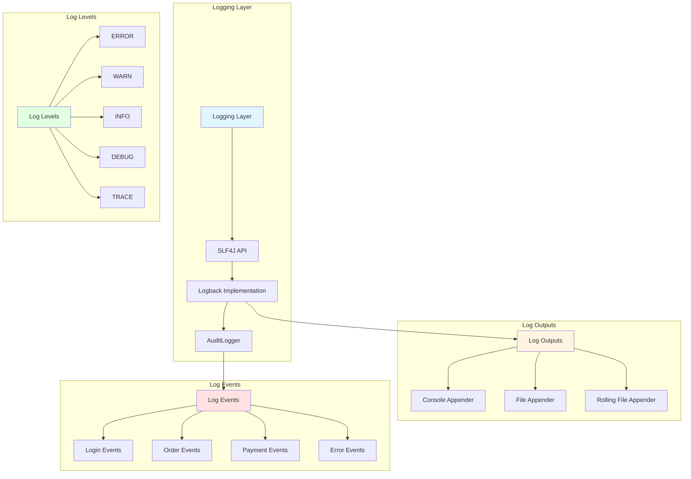
