# Database Schema

## Overview

The FashionStore database uses MySQL with InnoDB engine, supporting transactions and foreign key constraints. The schema consists of 30 tables organized to support e-commerce functionality.

## Database Configuration

- **Database Name:** fashionstore
- **Engine:** InnoDB
- **Character Set:** utf8mb4
- **Collation:** utf8mb4_general_ci
- **Total Tables:** 30

## Entity Relationship Diagram

```mermaid
erDiagram
    USERS ||--o{ CART_ITEMS : has
    USERS ||--o{ WISHLIST_ITEMS : has
    USERS ||--o{ SAVED_ITEMS : has
    USERS ||--o{ ORDERS : places
    USERS ||--o{ REVIEWS : writes
    USERS ||--o{ PAYMENT_METHODS : owns
    USERS ||--o{ ADDRESSES : has
    USERS ||--o{ PASSWORD_RESET_TOKENS : has
    USERS ||--o{ SEARCH_HISTORY : performs
    USERS ||--o{ RECENTLY_VIEWED : views
    USERS ||--o{ COUPON_USAGE : uses
    
    CATEGORIES ||--o{ PRODUCTS : contains
    PRODUCTS ||--o{ PRODUCT_SIZES : has
    PRODUCTS ||--o{ CART_ITEMS : in
    PRODUCTS ||--o{ WISHLIST_ITEMS : in
    PRODUCTS ||--o{ SAVED_ITEMS : in
    PRODUCTS ||--o{ ORDER_ITEMS : in
    PRODUCTS ||--o{ REVIEWS : has
    PRODUCTS ||--o{ PRODUCT_ATTRIBUTES : has
    PRODUCTS ||--o{ PRODUCT_RECOMMENDATIONS : has
    PRODUCTS ||--o{ SEARCH_HISTORY : matches
    PRODUCTS ||--o{ RECENTLY_VIEWED : viewed
    
    ORDERS ||--o{ ORDER_ITEMS : contains
    ORDERS ||--o{ PAYMENTS : has
    ORDERS ||--o{ ORDER_STATUS_HISTORY : tracks
    ORDERS ||--o{ PAYMENT_TRANSACTIONS : has
    ORDERS ||--o{ REFUNDS : has
    ORDERS ||--o{ INVOICES : has
    ORDERS ||--o{ COUPON_USAGE : uses
    ORDERS }o--|| ADDRESSES : billing
    ORDERS }o--|| ADDRESSES : shipping
    
    COUPONS ||--o{ COUPON_USAGE : used_in
    PAYMENT_METHODS ||--o{ PAYMENT_TRANSACTIONS : used_in
    
    CATEGORIES ||--o{ CATEGORIES : parent_of
```

## Core Tables

### USERS Table

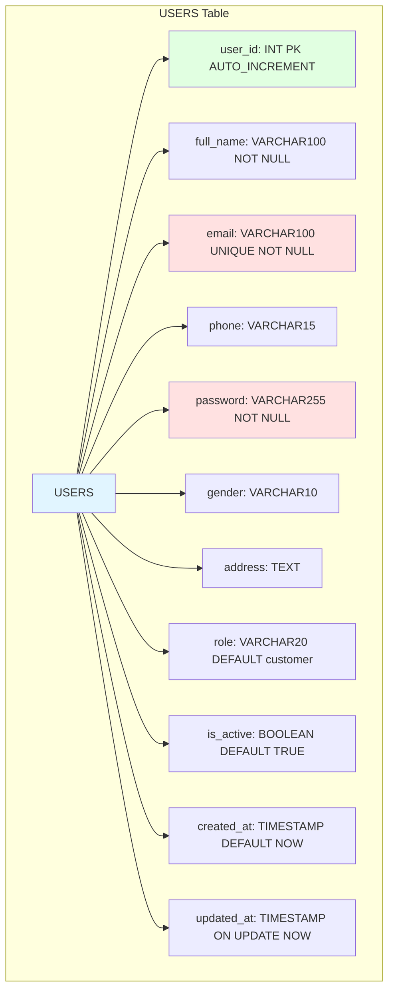

**Indexes:**
- PRIMARY KEY on user_id
- UNIQUE KEY on email

**Relationships:**
- One-to-Many with CART_ITEMS
- One-to-Many with WISHLIST_ITEMS
- One-to-Many with ORDERS
- One-to-Many with REVIEWS

---

### PRODUCTS Table

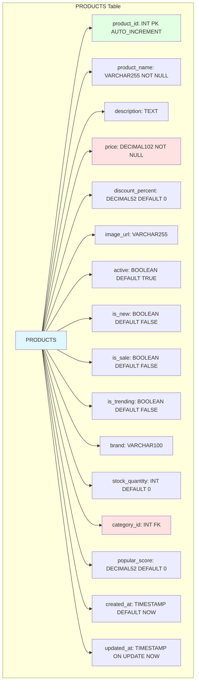

**Indexes:**
- PRIMARY KEY on product_id
- FOREIGN KEY on category_id
- INDEX on active, price
- INDEX on brand
- INDEX on is_new, is_sale, is_trending

**Relationships:**
- Many-to-One with CATEGORIES
- One-to-Many with PRODUCT_SIZES
- One-to-Many with CART_ITEMS

---

### ORDERS Table

```mermaid
graph TB
    subgraph "ORDERS Table"
        Order[ORDERS]
        OID[order_id: INT PK AUTO_INCREMENT]
        UID[user_id: INT FK]
        BillAddr[billing_address_id: INT FK]
        ShipAddr[shipping_address_id: INT FK]
        PayMethod[payment_method_id: INT FK]
        Coupon[coupon_id: INT FK]
        FName[full_name: VARCHAR100]
        Addr[address: TEXT]
        City[city: VARCHAR50]
        State[state: VARCHAR50]
        Zip[zip: VARCHAR10]
        Phone[phone: VARCHAR15]
        PayType[payment_method: VARCHAR20]
        Status[status: VARCHAR20 DEFAULT PLACED]
        ShipStatus[shipping_status: VARCHAR50 DEFAULT PROCESSING]
        Track[tracking_number: VARCHAR100]
        EstDel[estimated_delivery: DATE]
        ActDel[actual_delivery: DATE]
        Notes[notes: TEXT]
        Subtotal[subtotal: DECIMAL102 NOT NULL DEFAULT 0]
        Tax[tax_amount: DECIMAL102 DEFAULT 0]
        ShipFee[shipping_fee: DECIMAL102 DEFAULT 0]
        Disc[discount_amount: DECIMAL102 DEFAULT 0]
        Total[total_amount: DECIMAL102 NOT NULL]
        PayStatus[payment_status: ENUM DEFAULT pending]
        Gateway[payment_gateway: VARCHAR50]
        TransID[transaction_id: VARCHAR255]
        Created[created_at: TIMESTAMP DEFAULT NOW]
        Updated[updated_at: TIMESTAMP ON UPDATE NOW]
    end
    
    Order --> OID
    Order --> UID
    Order --> BillAddr
    Order --> ShipAddr
    Order --> PayMethod
    Order --> Coupon
    Order --> FName
    Order --> Addr
    Order --> City
    Order --> State
    Order --> Zip
    Order --> Phone
    Order --> PayType
    Order --> Status
    Order --> ShipStatus
    Order --> Track
    Order --> EstDel
    Order --> ActDel
    Order --> Notes
    Order --> Subtotal
    Order --> Tax
    Order --> ShipFee
    Order --> Disc
    Order --> Total
    Order --> PayStatus
    Order --> Gateway
    Order --> TransID
    Order --> Created
    Order --> Updated
    
    style Order fill:#e1f5ff
    style OID fill:#e1ffe1
    style UID fill:#ffe1e1
    style Total fill:#ffe1e1
    style Status fill:#ffe1e1
```

**Indexes:**
- PRIMARY KEY on order_id
- FOREIGN KEY on user_id, billing_address_id, shipping_address_id
- INDEX on status, created_at DESC
- INDEX on user_id, created_at DESC

**Relationships:**
- Many-to-One with USERS
- One-to-Many with ORDER_ITEMS
- One-to-Many with PAYMENTS

---

## Supporting Tables

### CATEGORIES Table

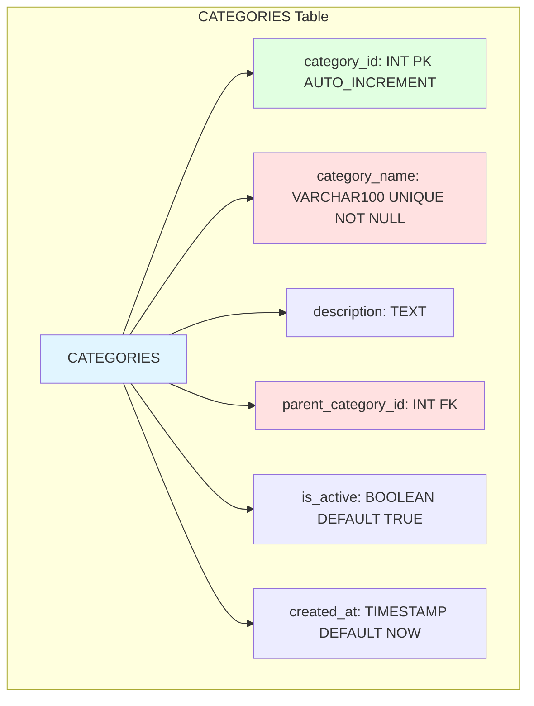

**Relationships:**
- Self-reference for parent-child hierarchy
- One-to-Many with PRODUCTS

---

### CART_ITEMS Table

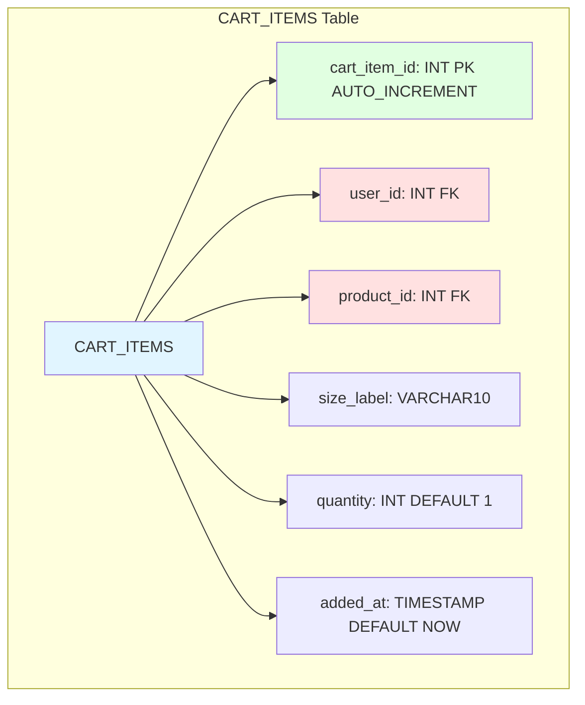

**Relationships:**
- Many-to-One with USERS
- Many-to-One with PRODUCTS

---

### WISHLIST_ITEMS Table

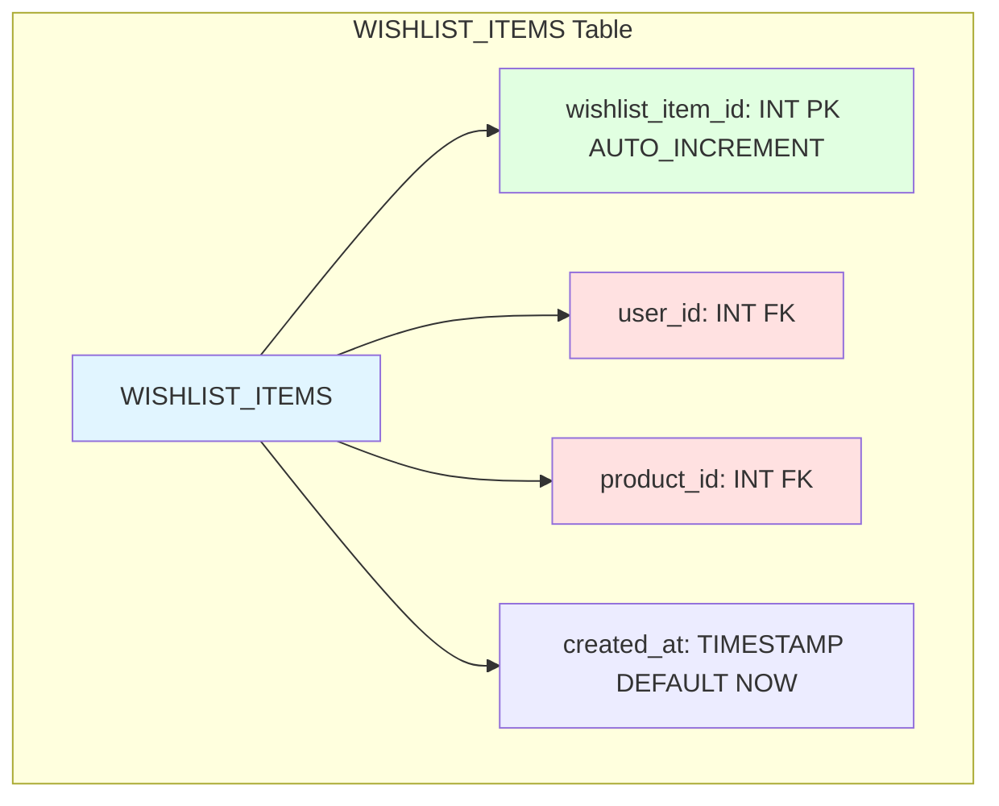

**Relationships:**
- Many-to-One with USERS
- Many-to-One with PRODUCTS

---

### PAYMENTS Table

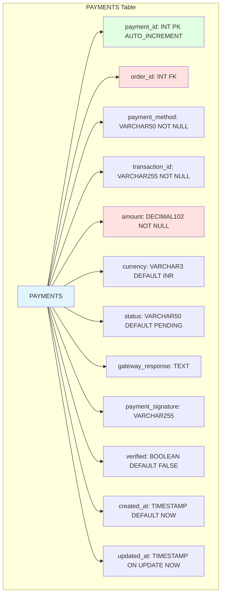

**Relationships:**
- Many-to-One with ORDERS

---

### REVIEWS Table

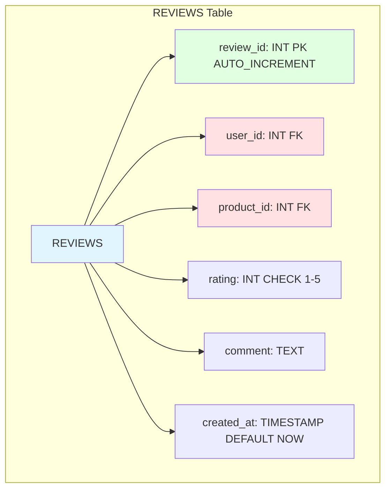

**Relationships:**
- Many-to-One with USERS
- Many-to-One with PRODUCTS

---

## Database Indexes

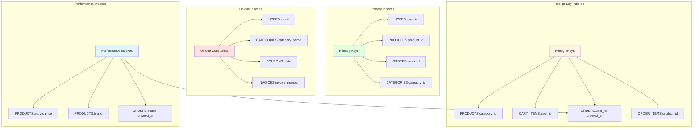

## Database Views

### v_trending_products
Returns top 50 trending products ordered by popular_score.

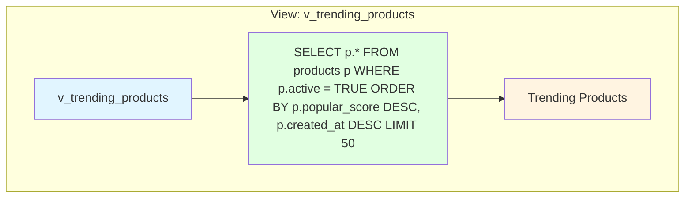

### v_low_stock_products
Returns products with low stock (≤10 items).

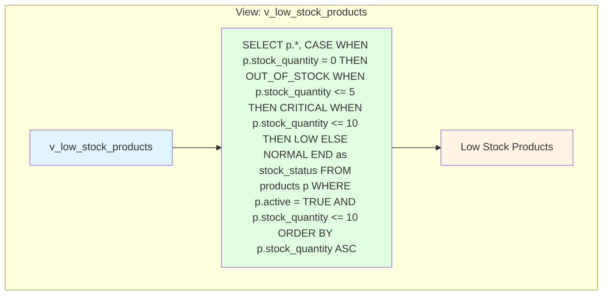

## Database Triggers

### trg_product_update_timestamp
Automatically updates the `updated_at` timestamp when a product is updated.

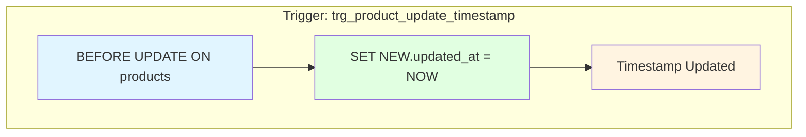

### trg_prevent_duplicate_pending_orders
Prevents duplicate pending orders within 5 minutes for the same user.

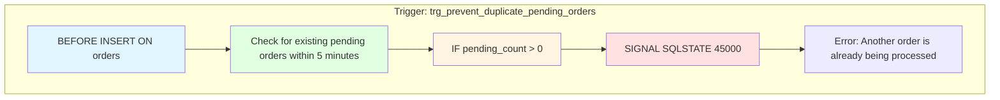

## Table Relationships Summary

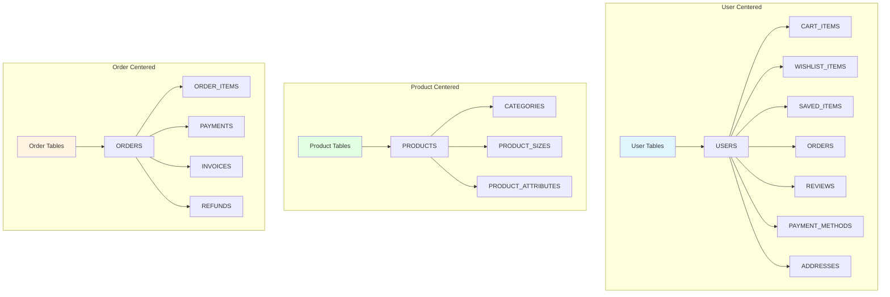
