# Process Flows

## Overview

This document describes the key process flows in the FashionStore application, showing the sequence of operations for user interactions and business processes.

## User Registration Flow

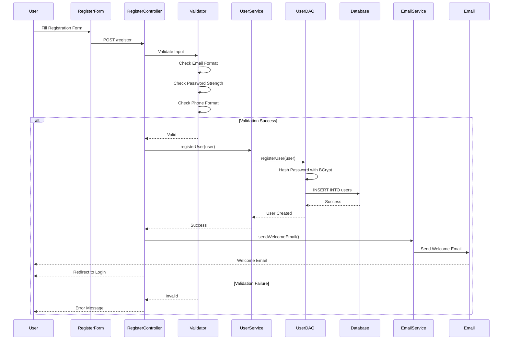

## User Login Flow

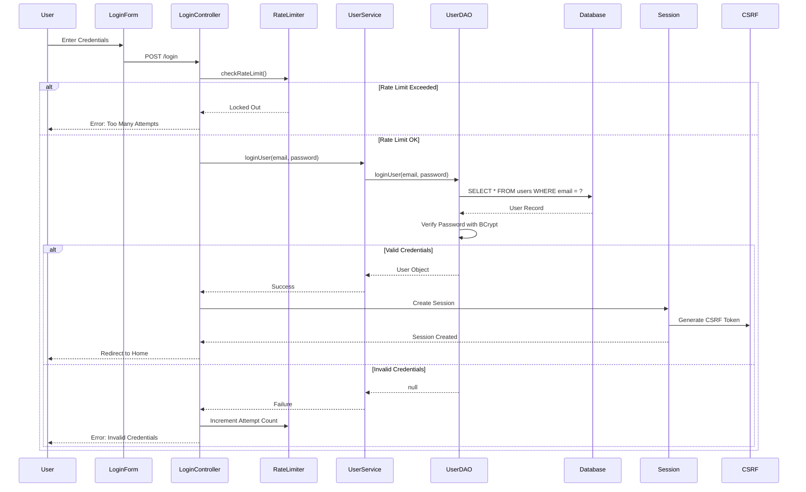

## Product Browsing Flow

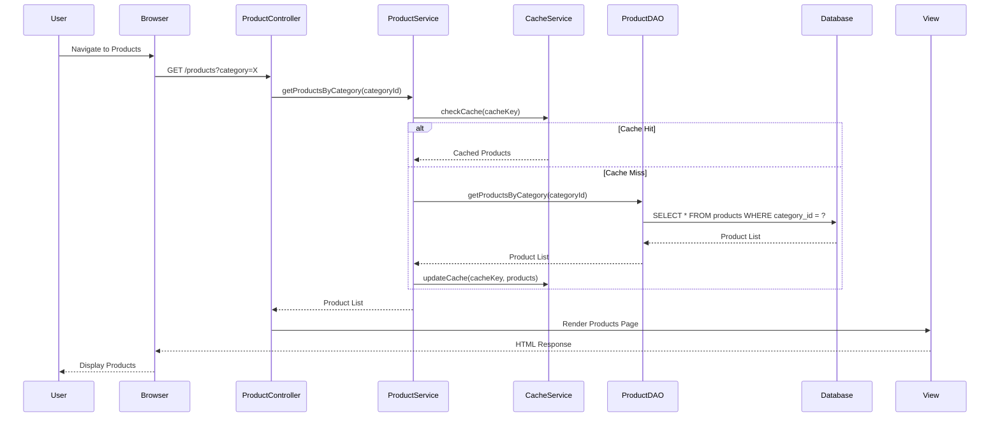

## Add to Cart Flow

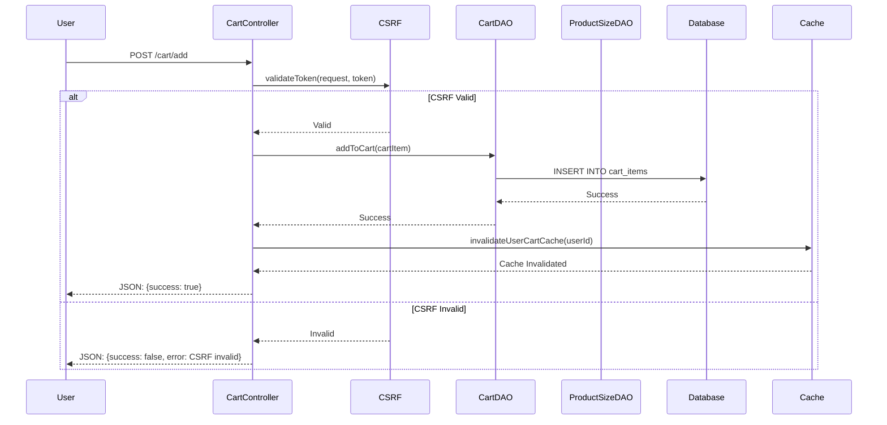

## Checkout Flow

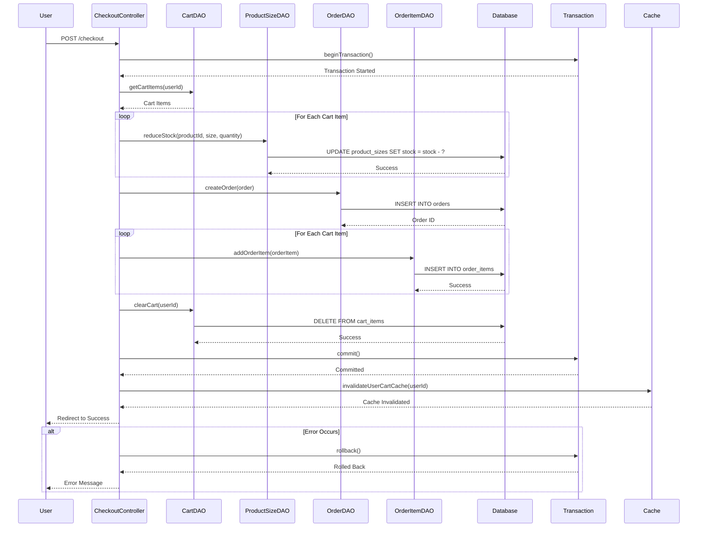

## Payment Processing Flow

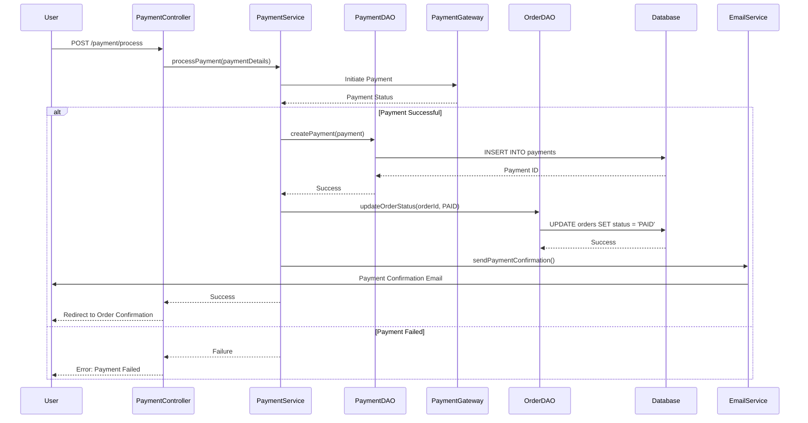

## Order Status Update Flow

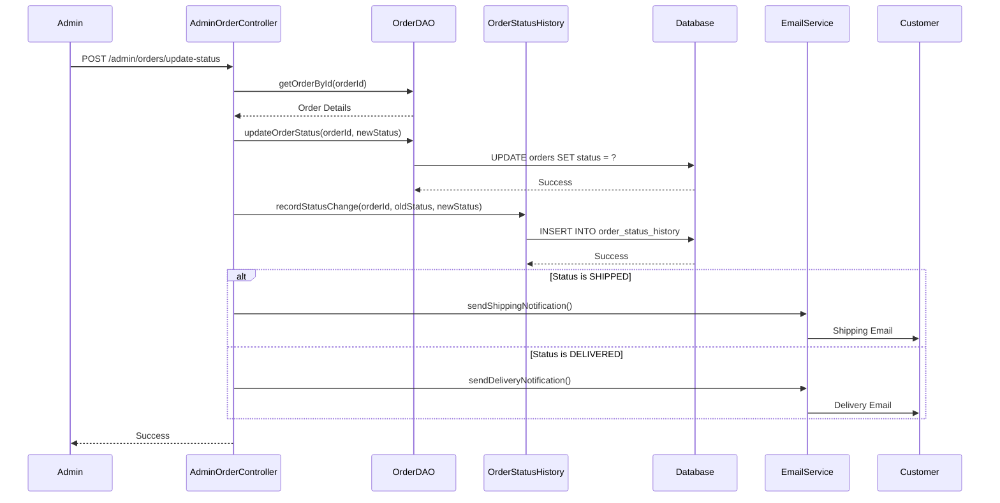

## Password Reset Flow

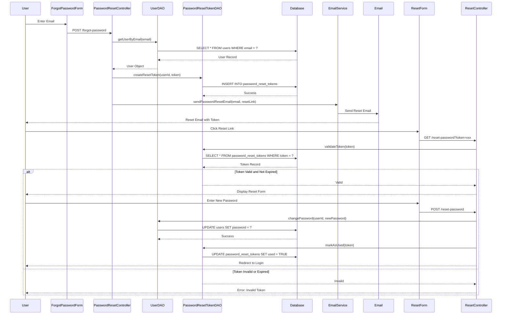

## Product Search Flow

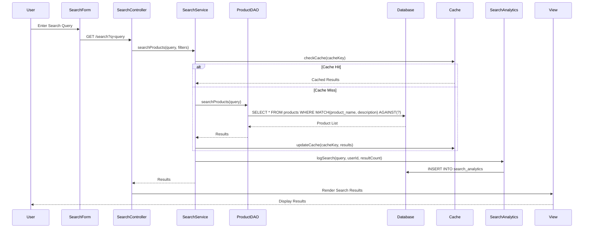

## Review Submission Flow

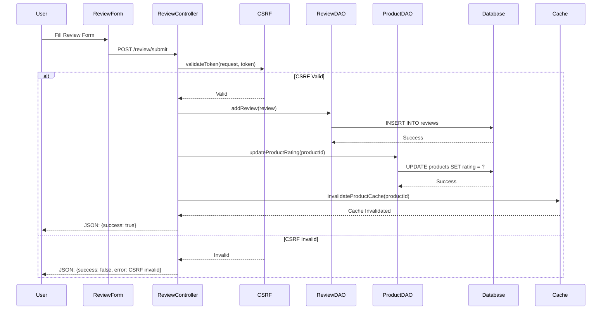

## Wishlist Management Flow

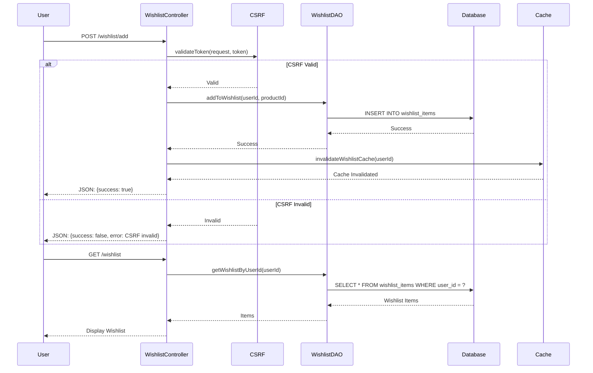

## Admin Product Management Flow

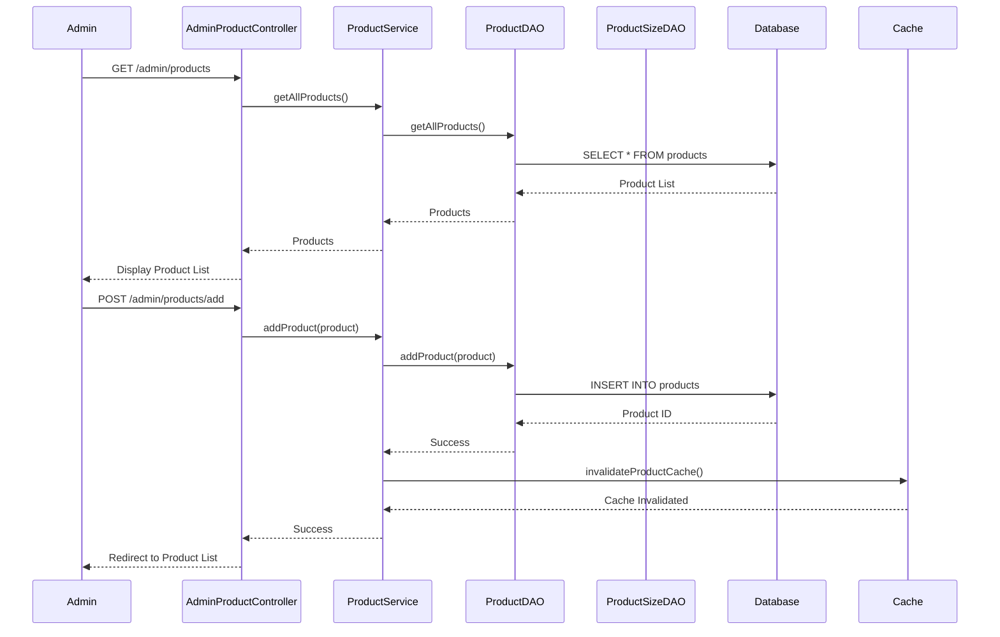

## Cache Invalidation Flow

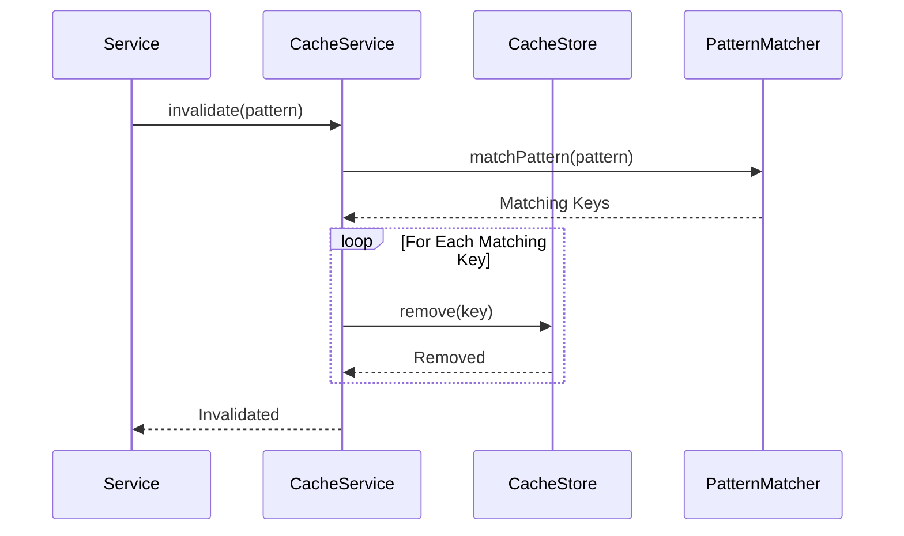

## Email Notification Flow

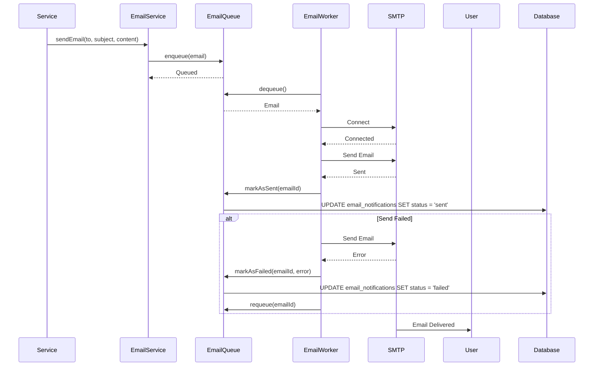
