# Component Design

## Overview

This document describes the component design of the FashionStore application, showing how different components interact and their responsibilities.

## Controller Components

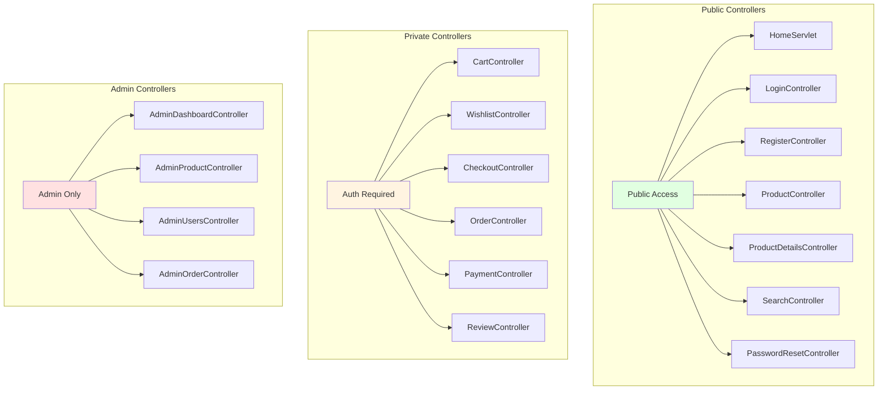

## Service Layer Components

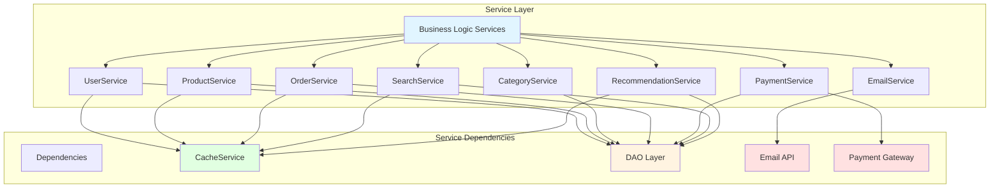

## DAO Layer Components

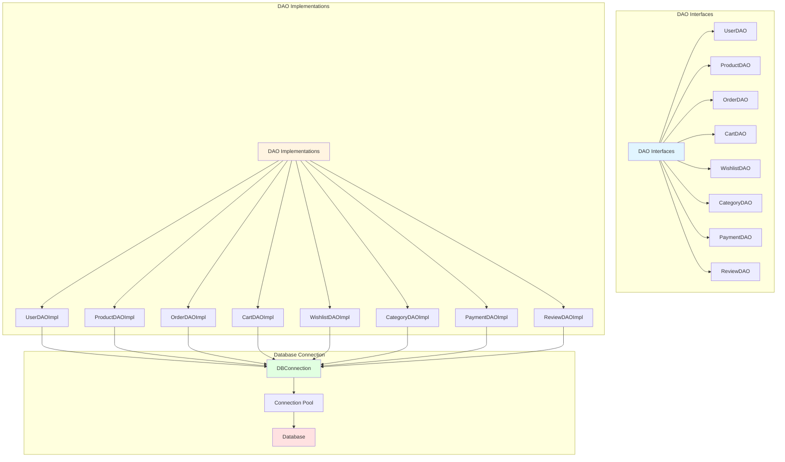

## Security Components

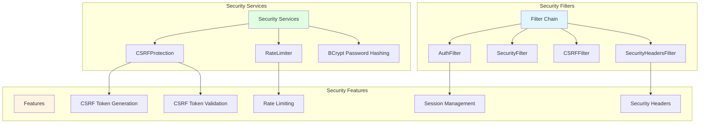

## Cache Components

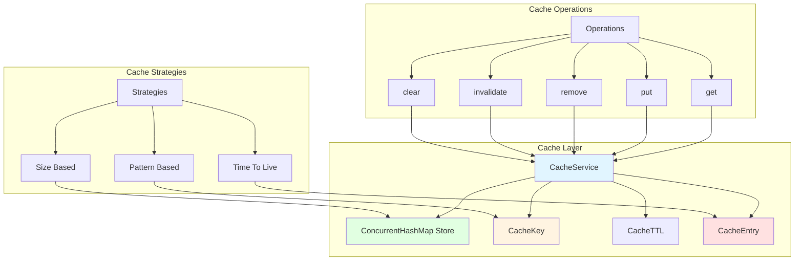

## Validation Components

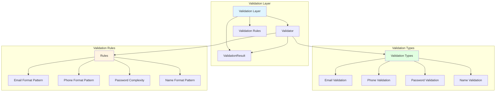

## Email Components

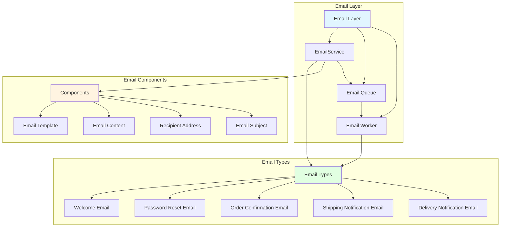

## Model Components

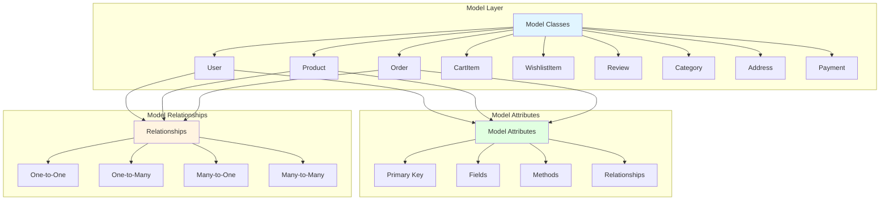

## Filter Components

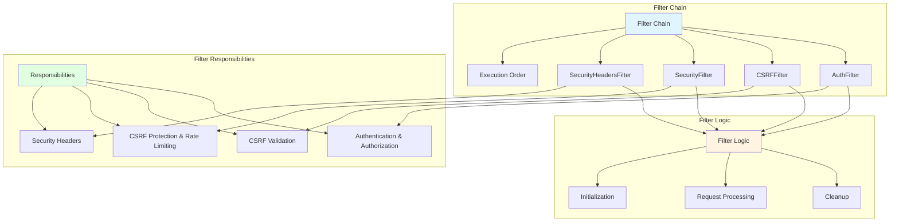

## Exception Handling Components

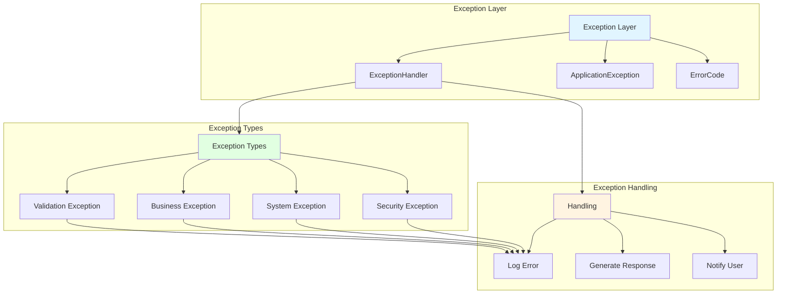

## Utility Components

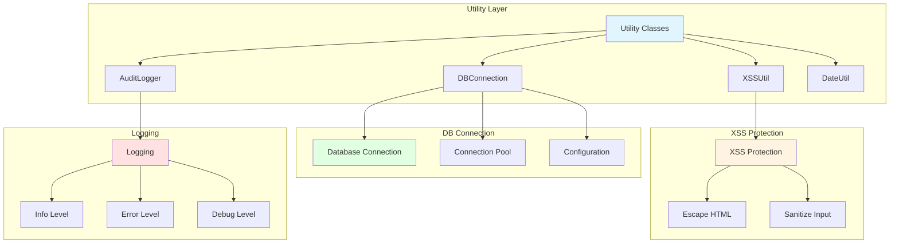

## Component Interaction Diagram

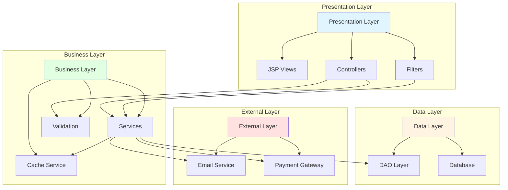
