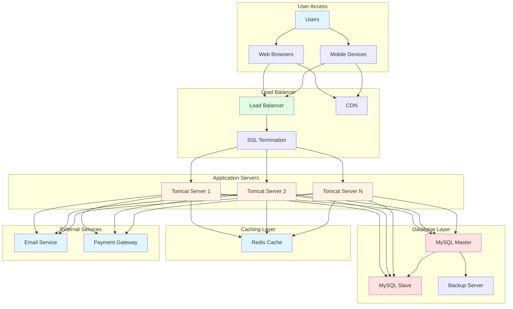
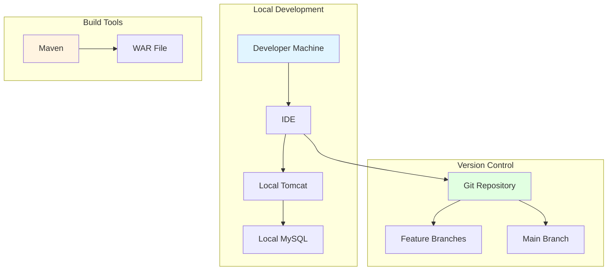
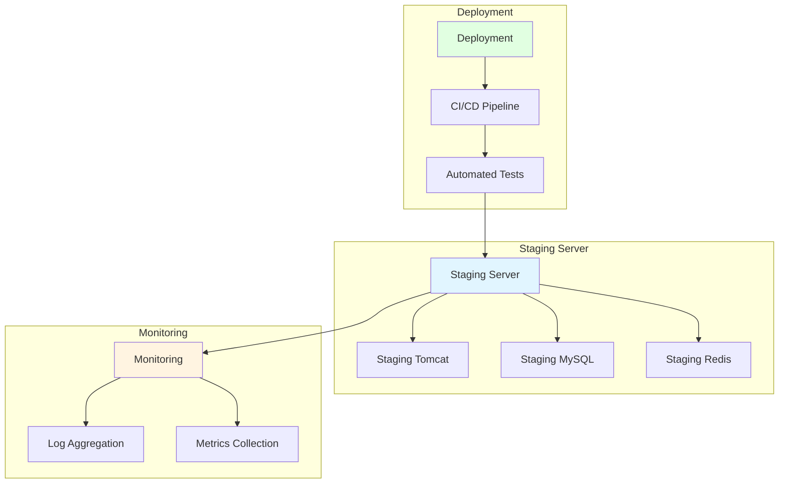
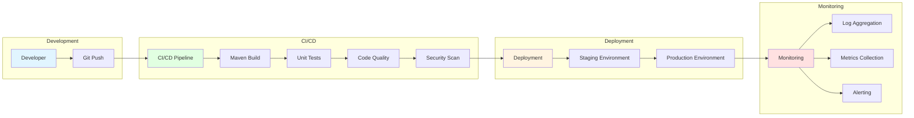
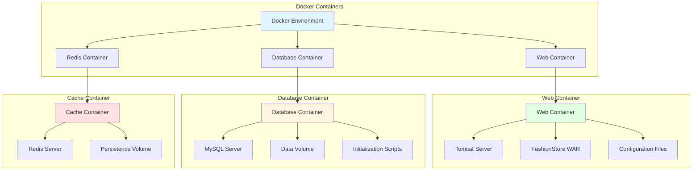
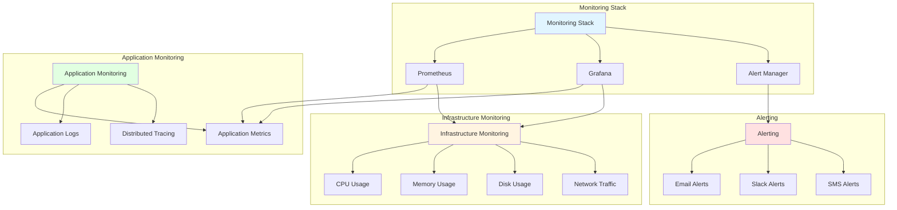
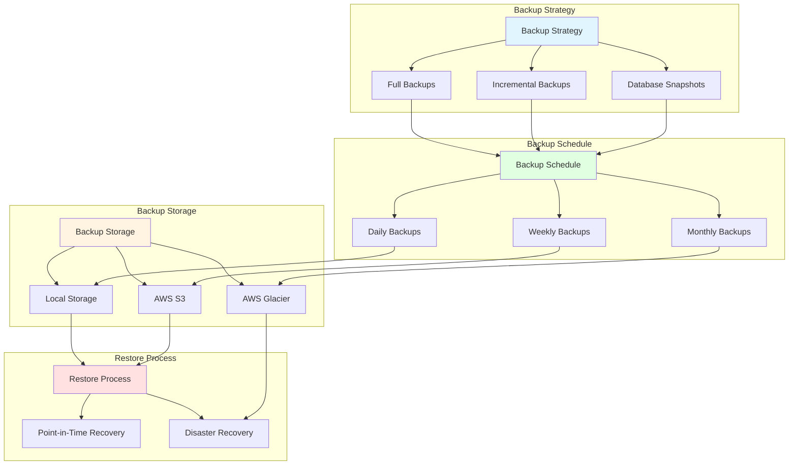
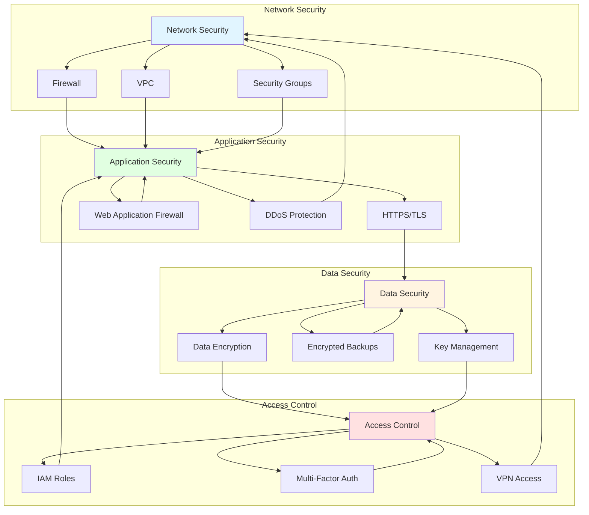
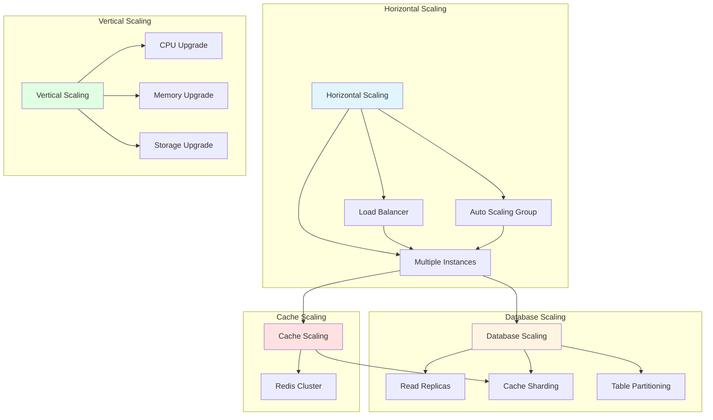
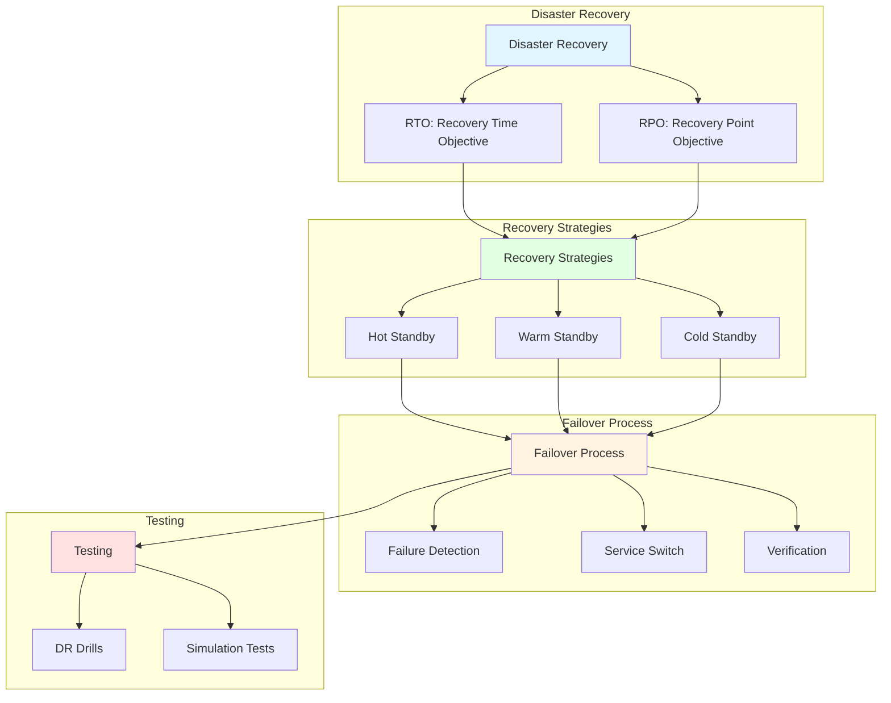

# Deployment Architecture

## Overview

This document describes the deployment architecture of the FashionStore application, including server configuration, infrastructure setup, and deployment strategies.

## Production Deployment Architecture



## Development Environment



## Staging Environment



## CI/CD Pipeline



## Docker Containerization



## Kubernetes Deployment

```mermaid
graph TB
    subgraph "Kubernetes Cluster"
        K8s[Kubernetes Cluster]
        Namespace[Namespaces]
        Pods[Pods]
        Services[Services]
        Ingress[Ingress Controller]
    end
    
    subgraph "Deployment"
        Deploy[Deployment]
        ReplicaSet[Replica Set]
        Container[Containers]
    end
    
    subgraph "Services"
        SVC[Services]
        ClusterIP[ClusterIP Service]
        NodePort[NodePort Service]
        LoadBalancer[LoadBalancer Service]
    end
    
    subgraph "Storage"
        Storage[Storage]
        PVC[Persistent Volume Claims]
        PV[Persistent Volumes]
        ConfigMap[ConfigMaps]
        Secret[Secrets]
    end
    
    K8s --> Namespace
    K8s --> Pods
    K8s --> Services
    K8s --> Ingress
    
    Deploy --> ReplicaSet
    ReplicaSet --> Container
    
    SVC --> ClusterIP
    SVC --> NodePort
    SVC --> LoadBalancer
    
    Storage --> PVC
    Storage --> PV
    Storage --> ConfigMap
    Storage --> Secret
    
    style K8s fill:#e1f5ff
    style Deploy fill:#e1ffe1
    style SVC fill:#fff4e1
    style Storage fill:#ffe1e1
```

## Monitoring Architecture



## Backup Strategy



## Security Architecture



## Scalability Architecture



## Disaster Recovery


